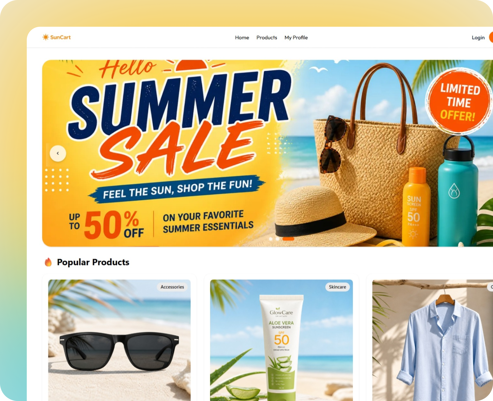

# SunCart 🛒

[](https://nextjs.org/)
[](https://react.dev/)
[](https://tailwindcss.com/)
[](https://better-auth.com/)
[](https://www.mongodb.com/)
[](https://suncart-pink.vercel.app)

SunCart is a premium, modern, and feature-rich e-commerce showcase web application specifically curated for summer care essentials. It features robust secure authentication, dynamic details pages, elegant loaders, and stunning UI/UX design with responsive layouts.

---

## 🔗 Live Links & Resources

* **Live Application URL:** [https://suncart-pink.vercel.app](https://suncart-pink.vercel.app)
* **GitHub Repository:** [RizviBR0/suncart](https://github.com/RizviBR0/suncart)

---

## 📋 GitHub Repository Details (For Quick Copy-Paste)
When setting up your repository on GitHub, copy-paste these details:
* **Description:** A premium, responsive summer care e-commerce showcase web application. Built with Next.js 16, React 19, MongoDB, and Better Auth. Features social login, dynamic product pages, and elegant UI/UX.
* **Website:** `https://suncart-pink.vercel.app`
* **Topics/Tags:** `nextjs`, `react`, `mongodb`, `better-auth`, `heroui`, `tailwindcss`, `e-commerce`

---

## 🖼️ Application Preview

Below is a preview of the SunCart homepage:



---

## ✨ Key Features

* 🔐 **Secure Multi-Method Authentication:**
  * Fast and secure **Email & Password** registration and sign-in.
  * Easy social sign-in using **Google OAuth**.
  * Complete session control managed via `better-auth` and stored in MongoDB database collections.
* ⚡ **Interactive E-Commerce Interface:**
  * Dynamic **Hero Slider Carousel** promoting summer care campaigns.
  * Grid layout showcasing **Popular Products** with badges and price details.
  * Engaging sections highlighting **Summer Care Tips** and **Top Brands**.
* 🛍️ **Dynamic Product Catalog & Details:**
  * Interactive catalog of items.
  * Dedicated dynamic detail pages (`/products/[id]`) highlighting ratings, detailed specifications, pricing, and visual highlights.
  * Subtle hover effects and micro-animations (e.g. wobble animations on action buttons) to boost interactivity.
* 📱 **Optimized Responsive Layout:**
  * Tailored for all viewports (Mobile, Tablet, Desktop).
  * Collapsible navigation header with animated mobile menu triggers.
* 🔔 **Real-Time Notification Systems:**
  * Seamless notification triggers using `react-toastify` for validation errors, login success, register updates, and logout feedback.
* 🌀 **Premium Transition Skeletons:**
  * Beautiful HeroUI skeletons for active page states, preventing layout shifts during user authentication checks and data fetches.

---

## 🛠️ Main Technology Stack

* **Framework:** **Next.js 16.2.4** (App Router, Server Components & Route Handlers)
* **Library:** **React 19.2.4** & **React DOM 19.2.4**
* **Styling & Components:** **Tailwind CSS v4** & **HeroUI v3.0.3**
* **Database:** **MongoDB 7.2.0**
* **Authentication:** **Better Auth 1.6.9** (with `@better-auth/mongo-adapter`)
* **Animations:** **Animate.css 4.1.1**

---

## 📦 Package Dependencies

### Production Dependencies
| Dependency | Version | Purpose |
| :--- | :--- | :--- |
| `next` | `16.2.4` | Full-stack React framework with SSR and App Router support |
| `react` / `react-dom` | `19.2.4` | Component-based UI library |
| `better-auth` | `1.6.9` | Authentication framework for TypeScript/JavaScript apps |
| `@better-auth/mongo-adapter` | `1.6.9` | Adapter storing sessions and users in MongoDB collections |
| `mongodb` | `7.2.0` | Official client driver for MongoDB |
| `@heroui/react` | `3.0.3` | Beautiful UI design components, buttons, and loading skeletons |
| `@heroui/styles` | `3.0.3` | Core styles and design systems for HeroUI components |
| `animate.css` | `4.1.1` | Declarative CSS animations library |
| `react-toastify` | `11.1.0` | Clean and custom notification toasts |
| `react-icons` | `5.6.0` | SVG icons bundle for React applications |
| `@iconify/react` | `6.0.2` | SVG icons from multiple Iconify libraries |
| `@gravity-ui/icons` | `2.18.0` | Premium style icon library |

### Development Dependencies
| Dependency | Version | Purpose |
| :--- | :--- | :--- |
| `tailwindcss` | `^4` | Utility-first CSS framework |
| `@tailwindcss/postcss` | `^4` | Tailwind CSS PostCSS plugin compiler integration |
| `babel-plugin-react-compiler` | `1.0.0` | React compiler optimization plugin |
| `eslint` / `eslint-config-next` | `^9` / `16.2.4` | Standard linting for React and Next.js applications |

---

## 🚀 Guidelines to Run the Project Locally

Follow these steps to set up and run SunCart on your local machine:

### 1. Prerequisites
Ensure you have **Node.js** (v18+ recommended) and **npm** installed on your system.

### 2. Clone the Repository
```bash
git clone https://github.com/RizviBR0/suncart.git
cd suncart
```

### 3. Install Dependencies
```bash
npm install
```

### 4. Configure Environment Variables
Create a `.env` file in the root of the project and populate it with the following environment variables:

```env
# Secret key for encrypting Better-Auth sessions (Use a long random string)
BETTER_AUTH_SECRET=your_better_auth_secret_here

# Base URL for the auth server (http://localhost:3000 in development)
BETTER_AUTH_URL=http://localhost:3000

# MongoDB Atlas connection URI
MONGODB_URI=your_mongodb_connection_uri_here

# Google OAuth Credentials (for Google Login)
GOOGLE_CLIENT_ID=your_google_client_id_here
GOOGLE_CLIENT_SECRET=your_google_client_secret_here
```

### 5. Run the Development Server
```bash
npm run dev
```
Open [http://localhost:3000](http://localhost:3000) in your web browser.

### 6. Build and Start Production Server
```bash
npm run build
npm run start
```
